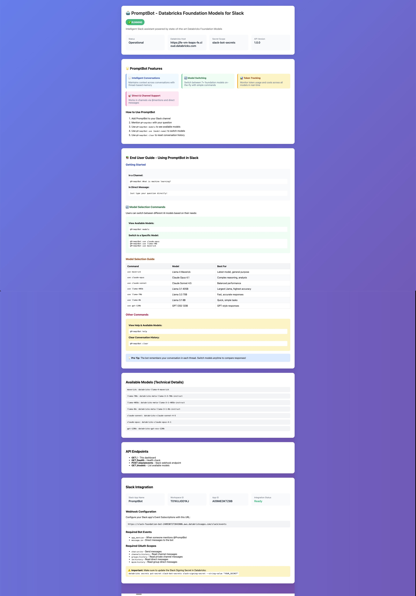

# Slack Bot with Databricks Foundation Models

[](https://github.com/honnuanand/Slack-with-Foundation-Models/actions/workflows/tests.yml)
[](https://www.python.org/downloads/)
[](https://opensource.org/licenses/MIT)
[](https://databricks.com)
[](https://api.slack.com)

Production-ready Slack bot powered by Databricks Foundation Models with real-time metrics dashboard.



## 🎯 What This Does

- **Slack Integration**: Chat with 7 Databricks Foundation Models directly in Slack
- **Real-time Dashboard**: Web dashboard with metrics, model usage, and system information
- **Socket Mode**: Instant responses via WebSocket connection
- **Model Switching**: Users can switch between models on-the-fly
- **Conversation Memory**: Maintains context per Slack thread
- **Production Deployment**: Runs on Databricks Apps with auto-scaling

## ✨ Features

### For End Users
- 🤖 **7 Foundation Models** - Llama 4 Maverick, Claude Opus 4.1, Claude Sonnet 4.5, Llama 405B, Llama 70B, Llama 8B, GPT OSS 120B
- 💬 **Context-Aware Conversations** - Remembers conversation history per thread
- 🔄 **Easy Model Switching** - Change models with simple commands
- ⚡ **Instant Responses** - Socket Mode for real-time communication

### For Administrators
- 📊 **Metrics Dashboard** - Track requests, tokens, users, and model usage
- 🎨 **Beautiful UI** - Left navigation panel for easy access to all sections
- 📈 **Usage Analytics** - Per-model statistics and trends
- 🔧 **System Information** - Complete deployment and configuration details
- 📚 **Built-in Documentation** - User guide and help directly in dashboard

## 🚀 Quick Start

### Prerequisites
- Databricks workspace with Foundation Models enabled
- Slack workspace with admin access
- Personal Access Token (PAT) for Databricks

### 1. Set Up Slack App

See detailed instructions in [SLACK_SETUP_GUIDE.md](SLACK_SETUP_GUIDE.md)

**Quick version:**
1. Create Slack app at https://api.slack.com/apps
2. Enable Socket Mode and create App-Level Token
3. Add OAuth scopes: `app_mentions:read`, `chat:write`, `im:history`, `im:read`, `im:write`
4. Subscribe to events: `app_mention`, `message.im`
5. Install app to workspace

### 2. Deploy to Databricks Apps

See detailed instructions in [DATABRICKS_APP_DEPLOYMENT.md](DATABRICKS_APP_DEPLOYMENT.md)

**Quick version:**
```bash
# Update app.yml with your tokens
vim app.yml

# Upload to Databricks
databricks workspace import-dir . /Workspace/Users/your.email@company.com/apps/slack-bot

# Create and deploy app
databricks apps create slack-foundation-bot
databricks apps deploy slack-foundation-bot \
  --source-code-path /Workspace/Users/your.email@company.com/apps/slack-bot \
  --mode SNAPSHOT
```

### 3. Use the Bot!

**In Slack channels:**
```
@PromptBot What is machine learning?
@PromptBot use claude-opus
@PromptBot Explain transformers in AI
```

**In direct messages:**
```
Just type your question!
```

**View Dashboard:**
Visit your app URL (provided after deployment) to see metrics and analytics.

## 📊 Available Models

| Command | Model | Best For |
|---------|-------|----------|
| `use maverick` | Llama 4 Maverick | Latest, general purpose |
| `use claude-opus` | Claude Opus 4.1 | Complex reasoning, detailed analysis |
| `use claude-sonnet` | Claude Sonnet 4.5 | Balanced performance, speed |
| `use llama-405b` | Llama 3.1 405B | Highest accuracy, complex tasks |
| `use llama-70b` | Llama 3.3 70B | Fast, accurate responses |
| `use llama-8b` | Llama 3.1 8B | Quick, simple tasks |
| `use gpt-120b` | GPT OSS 120B | GPT-style responses |

## 📂 Project Structure

```
slack-foundation-bot/
├── app.py                           # Main application (Socket Mode + Dashboard)
├── app.yml                          # Databricks Apps configuration
├── requirements.txt                 # Python dependencies
├── README.md                        # This file
├── DATABRICKS_APP_DEPLOYMENT.md    # Deployment guide
├── SLACK_SETUP_GUIDE.md            # Slack app setup
├── SERVICE_PRINCIPAL_INVESTIGATION.md  # Auth research findings
├── CHANGELOG.md                     # Version history
│
└── archive/                         # Historical/experimental files
    ├── experimental/                # Old development versions
    ├── deployed-backups/            # Deployment history
    └── docs/                        # Archived documentation
```

## 🔧 Technical Details

### Architecture
- **FastAPI** - Web server for dashboard
- **Slack Bolt** - Socket Mode handler for Slack
- **Threading** - Runs FastAPI and Socket Mode concurrently
- **OpenAI-compatible API** - Uses standard OpenAI format for model calls

### Authentication
- **Databricks**: Personal Access Token (PAT) required
- **Service Principal**: Tested but NOT supported for foundation models ([details](SERVICE_PRINCIPAL_INVESTIGATION.md))
- **Slack**: Bot Token + App-Level Token

### Deployment
- **Platform**: Databricks Apps (serverless)
- **Scaling**: Auto-scaling (1-3 instances)
- **Monitoring**: Built-in metrics dashboard
- **Updates**: Deploy new code via Databricks CLI

## 🔍 Troubleshooting

### Bot Not Responding
1. Check Socket Mode is enabled in Slack app settings
2. Verify tokens are correct in app.yml
3. Check deployment status: `databricks apps get slack-foundation-bot`

### Dashboard Not Accessible
- Dashboard requires Databricks OAuth authentication
- Socket Mode bot works independently of dashboard access

### Model Errors
- Verify model endpoints exist in your workspace
- Check Databricks token has proper permissions
- See [Databricks Foundation Models docs](https://docs.databricks.com/en/machine-learning/foundation-models/index.html)

## 📚 Documentation

- **[DATABRICKS_APP_DEPLOYMENT.md](DATABRICKS_APP_DEPLOYMENT.md)** - Complete deployment guide
- **[SLACK_SETUP_GUIDE.md](SLACK_SETUP_GUIDE.md)** - Slack app configuration
- **[SERVICE_PRINCIPAL_INVESTIGATION.md](SERVICE_PRINCIPAL_INVESTIGATION.md)** - Authentication research findings
- **[CHANGELOG.md](CHANGELOG.md)** - Version history and deployment IDs

### Archived Documentation
Older experimental code and documentation has been archived in `archive/` directory:
- **archive/experimental/** - CLI tools and development versions
- **archive/deployed-backups/** - Previous deployment snapshots
- **archive/docs/** - Archived guides (OpenAI testing, quickstarts, etc.)

## 🎓 Key Learnings

### Service Principal Authentication
We thoroughly investigated using Databricks Apps service principal for authentication instead of personal access tokens. **Result**: Service principal tokens work for general Databricks APIs but are **NOT accepted** by foundation model serving endpoints.

**See [SERVICE_PRINCIPAL_INVESTIGATION.md](SERVICE_PRINCIPAL_INVESTIGATION.md) for full details.**

**Recommendation**: Use a dedicated service account user's PAT instead of personal tokens for better security and maintainability.

## 🤝 Contributing

This is a production-ready reference implementation demonstrating:
- Databricks Apps deployment
- Socket Mode Slack integration
- Foundation Models usage
- Real-time dashboards
- Authentication best practices

Feel free to use this as a template for your own Slack bots!

## 📝 License

MIT

## 🔗 Links

- [Databricks Foundation Models](https://docs.databricks.com/en/machine-learning/foundation-models/index.html)
- [Databricks Apps Documentation](https://docs.databricks.com/en/dev-tools/apps/index.html)
- [Slack Bolt for Python](https://slack.dev/bolt-python/)
- [Socket Mode Documentation](https://api.slack.com/apis/connections/socket)
